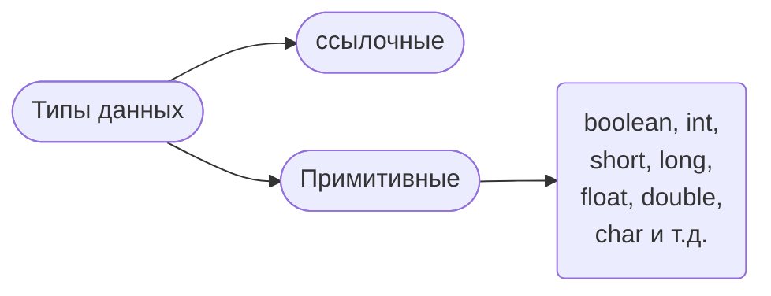
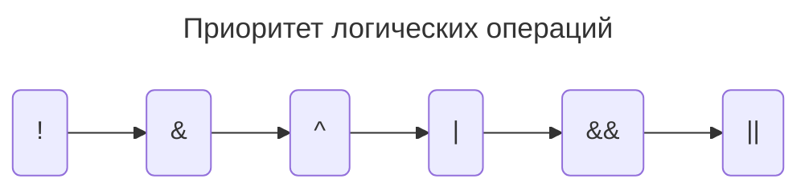
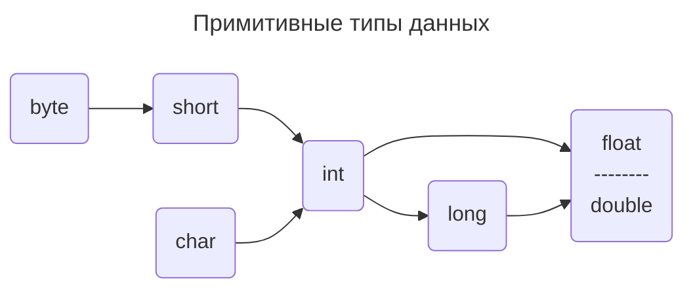
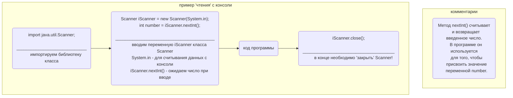
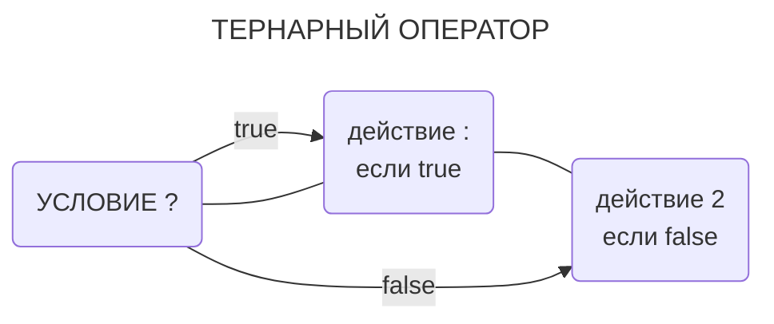
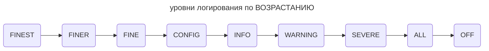

# язык программирования Java

## [ОГЛАВЛЕНИЕ](#оглавление) 

<details>
<summary><font size="2"> развернуть &#2AA9; </font> </summary>

* [Знакомство, начало работы](#знакомство-начало-работы)
* [Комментарии](#комментарии)
* [Типы данных и переменные](#типы-данных-и-переменные) 
	* [Создание переменной](#создание-переменной)
	* [Неявная типизапция](#неявная-типизапция)
	* [Классы обертки](#классы-обертки)
* [Операции JAVA](#операции-java)
* [Логические операции](#логические-операции)
* [Массивы](#массивы)
	* [ОДНОМЕРНЫЕ](#одномерные)
	* [МНОГОМЕРНЫЕ](#многомерные)
* [Преобразования](#преобразования)
* [Получение данных из терминала Scanner](#получение-данных-из-терминала-scanner)
    * [ПРОВЕРКА на соответствие получаемого типа](#проверка-на-соответствие-получаемого-типа)
		* [`hasNext()`](#hasnext)
		* [`hasNextInt()`](#hasnextint)
		* [`hasNextLine()`](#hasnextline)
		* [`hasNextByte()...Short()...Long()...Float()...Double()`](#hasnextbyte-hasnextshort-hasnextlong-hasnextfloat-hasnextdouble)
    * [useDelimiter() метод "разделителя"](#usedelimiter-метод-разделителя)
* [Форматированный вывод](#форматированный-вывод)
* [Область видимости переменных](#область-видимости-переменных)
* [Функции и методы](#функции-и-методы)
* [Управляющие конструкции](#управляющие-конструкции)
    * [Условный оператор](#условный-оператор)
    * [Тернарный оператор](#тернарный-оператор)
* [SWITCH CASE оператор выбора](#оператор-выбора-switch-case)
* [Циклы](#циклы)
	* [while](#while)
	* [do while](#do-while)
	* [continue, break](#continue-break)
	* [for](#for)
		* [Вложенные циклы](#вложенные-циклы)
* [Работа с файлами](#работа-с-файлами)
	* [Создание и запись\ дозапись](#создание-и-запись-дозапись)
	* [Чтение, Вариант посимвольно](#чтение-вариант-посимвольно)
	* [Вариант построчно](#вариант-построчно)
* [Строки](#строки)
* [Работа с файловой системой](#работа-с-файловой-системой)
* [Логирование](#логирование)
* [Импорт](#импорт)
* [Xml](#xml)
* [Коллекции JAVA](#коллекции-java)
    <details>
    <summary><font size="2"> развернуть</font> </summary>

    * [OBJECT]()
    </details> 
</details>

___

### [Знакомство, начало работы](#знакомство-начало-работы)
##### [оглавление](#оглавление)
После создания файла и наименования для начала работы достаточно начать писать `class` и появиться подсказка, использовав ее, создадутся следующие строки
```java
public class program {

}
```
после `public class` в абсолютном большинстве случаев именовать class как имя файла.

Далее необходимо определить точку входу - достаточно начать писать `main` и нажать <kbd>ENTER</kbd>

Появятся строки `public static void main(String[] args){ }`
```java
public class program {

    public static void main(String[] args) {
        
    }
}
```

Запустить выполнение файла можно через команду `java program.java` - в VS code.

`program.java` это наимменование файла.

**ПРИМЕР вывода в консоль**
```java
public class program {
    public static void main(String[] args) {
        System.out.println("Hello world");
        
    }
}
```
___
### [Комментарии](#комментарии)
##### [оглавление](#оглавление)
Можно исползовать горячие клавиши:

<kbd>CTRL</kbd> + <kbd>/</kbd>

<kbd>SHIFT</kbd> + <kbd>ALT</kbd> + <kbd>A</kbd>

```java
// CTRL + /

/* 
 * SHIFT
 * ALT
 * A
*/
```
Или просто знаки `//` или `/* */`.

`/* */` - многосторочные комментарии
___

### [Типы данных и переменные](#типы-данных-и-переменные)
##### [оглавление](#оглавление)

* #### [Создание переменной](#создание-переменной)
```
<тип данных> <идентификатр>;
<идентификатор> = <значение>;
НЕ забываем про ;
```
При этом принято писать сразу `<тип данных> <идентификатр> = <значение>;` - необходимо идентифицировать начальное значение.

**ПОТОМУ ЧТО:**
```java
// Так выдает ошибку
String s;
System.out.println(s);
```

ПРИМЕРЫ данных: (для `float` необходимо использовать `f` в конце числа)

```java
public class program
{
    public static void main(String[] args) {
        short age = 10;
        int salary = 123456;
        System.out.println(age); //10
        System.out.println(salary); //123456

        float e = 2.7f;
        double pi = 3.1415;
        System.out.println(e); // 2.7
        System.out.println(pi); // 3.1415

        char ch = '1';
        System.out.println(Character.isDigit(ch)); // true
        ch = 'a';
        System.out.println(Character.isDigit(ch)); // false

        boolean flag1 = 123 <= 234;
        System.out.println(flag1); // true
        boolean flag2 = 123 >= 234 || flag1;
        System.out.println(flag2); // true
        boolean flag3 = flag1 ^ flag2;
        System.out.println(flag3); // false
        }
}
```

* Строки (не совсем простой тип данных)

```java
public class program
{
    public static void main(String[] args) {
        String msg ="Hello world";
        System.out.println(msg);
        }
}
```

* #### [Неявная типизапция](#неявная-типизапция)

Осуществляется через переменную `var`

```java
public class program
{
    public static void main(String[] args) {
        var ì = 123;
        System.out.println(i);
        }
}
```
ПРИМЕРЫ:
```java
public class program {
    public static void main(String[] args) {
        var a = 123;
        System.out.println(a); // 123
        var d = 123.456;
        System.out.println(d); // 123.456
        System.out.println(getType(a)); // Integer
        System.out.println(getType(d)); // Double
        d = 1022;
        System.out.println(d); // 1022
        //d = "mistake";
        //error: incompatible types:
        //String cannot be converted to double
    }
    static String getType(Object o){
        return o.getClass().getSimpleName();
    }
}
```
```java
public class program {
    public static void main(String[] args) {
        var d = 123.456;
        System.out.println(d); // 123.456
        System.out.println(getType(d)); // Double
        d = "mistake";
        // error: incompatible types:
        // String cannot be converted to double
    }
    static String getType(Object o){
        return o.getClass().getSimpleName();
    }
}
```

* #### [Классы обертки:](#классы-обертки)

|Примитив|Обертка|
|:----------:|:----------:|
int | Integer
short | Short
long | Long
byte | Byte
float | Float
double | Double
char | Character
boolean | Boolean

ПРИМЕР почему это важно:

сокращение `int` не даст использовать методы-функции для `Integer`
```java
public class program
{
 public static void main(String[] args) {
 System.out.println(Integer.MAX_VALUE); // 2147483647
 System.out.println(Integer.MIN_VALUE); // -2147483648
 }
}
```
___

### [Операции JAVA](#операции-java)
##### [оглавление](#оглавление)
|Присваивание|Арифметические|Опер. сравнения|Логические опер.|Побитовые опер.|
|:----------:|:----------:|:---------------:|:----------:|:------:|
| = | * | < | &#124;&#124; ( \| ) | << |
|  | / | > | && ( & ) | >> |
|  | + | == | ^ | & |
|  | - | != | ! | &#124; |
|  | % | >= |  | ^ |
|  | ++ инкремент | <= |  |  |
|  | -- декремент |  |  |  |

* Все **логические операторы** применяются к булевским выражениям, то есть таким, о которых можно сказать, `true` они или `false`.
* Если операторы `&`, `|` или `^` применяются к числам, речь идёт уже о **побитовых**. То есть оба числа переводятся в двоичную систему и к этим числам побитово применяют операции логического сложения, умножения или вычитания.
___

### [Логические операции](#логические-операции)
##### [оглавление](#оглавление)


| &#124;&#124; | Условное ИЛИ, (сокращённое логическое ИЛИ), `дизъюнкция`| если хотя бы один операнд равен `true`, то выражение `a\|b` гарантированно будет `true` независимо от значения второго. Использование `\|\|` вместо `\|` будет "экономнее", если операнд слева является `true`, проверка второго **НЕ** осуществляется. |
|:--------------:|:--------:|:------|
```java
System.out.println(true || true);   // true
System.out.println(true || false);  // true
System.out.println(false || true);  // true
System.out.println(false || false); // false
```

|&&|Условное И (сокращённое логическое И), `конъюнкция`| Возвращает `true` если оба операнда равны `true`. То же самое, что и `&`, но если операнд, находящийся слева от `&&` является `false`, данный оператор возвращает `false` без проверки второго операнда.|
|:--------------:|:--------:|:------|
```java
System.out.println(true && true);   // true
System.out.println(true && false);  // false
System.out.println(false && true);  // false
System.out.println(false && false); // false
```

| ^ | Логическое исключающее ИЛИ (XOR) | Возвращает `true`, если один и только один из операндов равен `true`. Возвращает `false`, если оба операнда равны `true` или `false`. По сути, возвращает `true`, если операнды — `разные`. |
|:--------------:|:--------:|:------|
```java
System.out.println(true ^ true);   // false
System.out.println(true ^ false);  // true
System.out.println(false ^ true);  // true
System.out.println(false ^ false); // false
```

| ! | Логическое "не" (отрицание) | `!x` означает "не x". Возвращает `true` если операнд является `false`. Возвращает `false` если операнд является `true`. |
|:--------------:|:--------:|:------|
```java
System.out.println(!true);   // false
System.out.println(!false);  // true
```


ПРИМЕР испльзования логического оператора и `boolean` с присваиванием
```java
boolean f = 123 <= 234;
```
___
### [Массивы](#массивы)
##### [оглавление](#оглавление)

* #### [ОДНОМЕРНЫЕ](#одномерные)
```java
int[] arr = new int[10];

int[] arr = new int[] { 1, 2, 3, 4, 5 };

// !!! поэкспериментировать !!!
int[] arr;
int brr[];
// ОТВЕТ:
// Они семантически идентичны.
// Синтаксис int array[] был добавлен только для того, чтобы помочь программистам на Си привыкнуть к java.
// !!! массив int[] гораздо предпочтительнее и менее запутан!!!!
```

```java
public class program {
    public static void main(String[] args) {
        int[] arr = new int[10];
        System.out.println(arr.length); // 10
        arr = new int[] { 1, 2, 3, 4, 5 };
        System.out.println(arr.length); // 5
    }
}
```

* #### [МНОГОМЕРНЫЕ](#многомерные)
```java
public class program {
    public static void main(String[] args) {
        int[] arr[] = new int[3][5];
            for (int[] line : arr) {
                for (int item : line) {
                    System.out.printf("%d ", item);
                }
                System.out.println();
        }
    }
}
```

```java
public class program {
    public static void main(String[] args) {
        int[][] arr = new int[3][5];
            for (int i = 0; i < arr.length; i++) {
                for (int j = 0; j < arr[i].length; j++) {
                    System.out.printf("%d ", arr[i][j]);
                }
                System.out.println();
        }
    }
}
```
___
### [Преобразования](#преобразования)
##### [оглавление](#оглавление)



```java
public class Program {
    public static void main(String[] args) {
        int i = 123; double d = i; // неявное преобразование
        System.out.println(i); // 123
        System.out.println(d); // 123.0

        d = 3.1415; i = (int)d;
        System.out.println(d); // 3.1415
        System.out.println(i); // 3

        d = 3.9415; i = (int)d;
        System.out.println(d); // 3.9415
        System.out.println(i); // 3

        byte b = Byte.parseByte("123");
        System.out.println(b); // 123

        b = Byte.parseByte("1234"); // позволяет хранить от 0 до 255 !!!
        System.out.println(b); // NumberFormatException: Value out of range
    }
}
```
**!!! НО** нельзя массив целых чисел `int` просто **"переложить"** в массив `вещественных` чисел
```java
public class program {
    public static void main(String[] args) {
        int[] a = new int[10];
        double[] d = a; // ИЗУЧАЕМ ковариантность и контравариантность
        // program.java:4: error: incompatible types: int[] cannot be converted to double[]
    }
}
```
___
### [Получение данных из терминала Scanner](#получение-данных-из-терминала-scanner)
##### [оглавление](#оглавление)
Используем класс `Scanner` - тот класс пригодится, если нужно считывать данные, которые вводят пользователь.

Класс считывает данные из источника, который для него указать.

Например, из строки, из файла, из консоли.

Далее он распознает эту информацию и обрабатывает нужным образом.

| метод | возвращает ... |
|:---|:---|
| `next()`       | след. строковое значение из одного слова (ПРОБЕЛ как разделитель по умолчанию) |
| `nextLine()`   | след. строковое значение из множества слов (БЕЗ разделителя) |
| `nextInt()`    | след. целочисленное значение |
| `nextDouble()` | след. Double значение |
| `nextFloat()`  | след. Float значение |
| `nextLong()`   | след. Long значение |
| `nextShort()`  | след. Short значение |



```java
import java.util.Scanner;
public class program {
    public static void main(String[] args) {

        Scanner iScanner = new Scanner(System.in);

        System.out.printf("name: ");
        String name = iScanner.nextLine();

        System.out.printf("Привет, %s!", name);
        iScanner.close();
    }
}
```

```java
import java.util.Scanner;
public class program {
    public static void main(String[] args) {
        
        Scanner iScanner = new Scanner(System.in);

        System.out.printf("int a: ");
        int x = iScanner.nextInt();

        System.out.printf("double a: ");
        double y = iScanner.nextDouble();

        System.out.printf("%d + %f = %f", x, y, x + y);
        iScanner.close();
    }
}
```
#### [ПРОВЕРКА на соответствие получаемого типа](#проверка-на-соответствие-получаемого-типа)
##### [оглавление](#оглавление)
Пользователь может ошибиться и ввести что-то не то.

Есть целая группа методов для этого решения:
* ### `hasNext()`

    Метод проверяет, есть ли у сканера другой "токен" на входе. Сканер разбивает вводимые данные на "токены", используя шаблон-разделитель, который по умолчанию соответствует пробелам.
    
    То есть функция hasNext() проверяет входные данные и возвращает значение true, если в нем есть другой символ, не являющийся пробелом.

```java
// пример работы с разделителем по умолчанию.
public class program {
    public static void main(String[] args) {
        String input_data = new StringBuilder()
            .append("magic\tproject\n")
            .append("     database: oracle\n")
            .append("dependencies:\n")
            .append("spring:foo:bar\n")
            .append("\n")  // обратите внимание, что ввод заканчивается пустой строкой
            .toString();
        Scanner scan = new Scanner(input_data);
        while (scan.hasNext()) {
            System.out.println(scan.next());
        }
        scan.close();
    }
}
/* 
magic
project
database:
oracle
dependencies:
spring:foo:bar
*/
```
Класс `Scanner` предоставляет метод [`useDelimiter(String pattern)`](#usedelimiter-метод-разделителя), который позволяет нам изменять разделитель в методе `hasNext()`.

Как только разделитель будет изменен, метод `hasNext()` выполнит проверку с новым разделителем вместо того, который используется по умолчанию.

* ### `hasNextInt()`
    
    метод проверяет, является ли следующая порция введенных данных числом, или нет (возвращает, соответственно, true или false)

* ### `hasNextLine()`

    проверяет, является ли следующая порция данных строкой.

* ### `hasNextByte(), hasNextShort(), hasNextLong(), hasNextFloat(), hasNextDouble()`

    все эти методы делают то же для остальных типов данных.

<br/>

```java
import java.util.Scanner;
public class program {
    public static void main(String[] args) {
 
        Scanner sc = new Scanner(System.in);
        System.out.println("Введите число:");

        if (sc.hasNextInt()) {
            int number = sc.nextInt();
            System.out.println("Спасибо! Вы ввели число " + number);
        } else {
            System.out.println("Извините, но это не число, попробуйте снова!");
        }
    }
}
```
#### [useDelimiter() метод "разделителя"](#usedelimiter-метод-разделителя)
##### [оглавление](#оглавление)
В этот метод передается строка, которую вы хотите использовать в качестве разделителя, используется совместно с методом [`hasNext()`](#hasnext).

Пример метода на хокку Мацуо Басе.

```java
public class Main {
   public static void main(String[] args) {
       Scanner scan = new Scanner("На голой ветке'" +
               "Ворон сидит одиноко.'" +
               "Осенний вечер." +
               "''***''" +
               "В небе такая луна,'" +
               "Словно дерево спилено под корень:'" +
               "Белеет свежий срез." +
               "''***''" +
               "Как разлилась река!'" +
               "Цапля бредет на коротких ножках,'" +
               "По колено в воде.");

       scan.useDelimiter("'");

       while (scan.hasNext()) {
           System.out.println(scan.next());
       }

       scan.close();
   }
}
```

```java
import java.util.Scanner;
public class program {
    public static void main(String[] args) {
        Scanner scan = new Scanner("На голой ветке'" +
                "Ворон сидит одиноко.'" +
                "Осенний вечер." +
                "''***''" +
                "В небе такая луна,'" +
                "Словно дерево спилено под корень:'" +
                "Белеет свежий срез." +
                "''***''" +
                "Как разлилась река!'" +
                "Цапля бредет на коротких ножках,'" +
                "По колено в воде.");
         
        String[] arr = new String[15];
        scan.useDelimiter("'");
        for (int i = 0; i < arr.length; i++) {
            arr[i] = scan.next();
            System.out.println(arr[i]);
        }
        // System.out.println(Arrays.toString(arr));
        
        // while (scan.hasNext()) {
        //     System.out.println(scan.next());
        // }
        
        scan.close();
    }
}
```

___
### [Форматированный вывод](#форматированный-вывод)
##### [оглавление](#оглавление)

```java
public class program {
    public static void main(String[] args) {
        int a = 1, b = 2;
        int c = a + b;
        String res = a + " + " + b + " = " + c;
        System.out.println(res);
    }
}
```
```java
public class program {
    public static void main(String[] args) {
        int a = 1, b = 2;
        int c = a + b;
        String res = String.format("%d + %d = %d \n", a, b, c);
        System.out.printf("%d + %d = %d \n", a, b, c);
        System.out.println(res);
    }
}
```
|Виды спецификаторов|Описание|
|:---:|:---|
| `%d` | для целочисленных значений |
| `%x` | для вывода шестнадцатеричных чисел |
| `%f` | для вывода чисел с плавающей точкой |
| `%e` | для вывода чисел в экспоненциальной форме, например, 3.1415e+01 |
| `%c` | для вывода одиночного символа |
| `%s` | для вывода строковых значений |

```java
public class program {
    public static void main(String[] args) {
        float pi = 3.1415f;
        System.out.printf("%f\n", pi);   // 3,141500
        System.out.printf("%.2f\n", pi); // 3,14
        System.out.printf("%.3f\n", pi); // 3,141
        System.out.printf("%e\n", pi);   // 3,141500e+00
        System.out.printf("%.2e\n", pi); // 3,14e+00
        System.out.printf("%.3e\n", pi); // 3,141e+00
    }
}
```
___
### [Область видимости переменных](#область-видимости-переменных)
##### [оглавление](#оглавление)

У переменных существует понятие «область видимости».

Если переменную объявили внутри некоторого блока фигурных скобок { }, то снаружи этого блока переменная будет недоступна.


```java
public class Program {
    public static void main(String[] args) {

    { // начало внутренненго блока кода
        int i = 123;
        System.out.println(i);
    } // конец блока

    System.out.println(i); // error: cannot find symbol
    }
}
```
Но если объявить переменную вне внутреннего блока, а потом использовать внутри, то переменная будет доступна.

```java
public class program {
    public static void main(String[] args) {
    int i = 123;

    { // начало внутренненго блока кода
        System.out.println(i); // 123      
    } // конец блока
    
    System.out.println(i); // 123
    }
}
```
___
### [Функции и методы](#функции-и-методы)
##### [оглавление](#оглавление)
Функции и методы — это технически одно и то же.

Функции могут не принадлежать классам, а методы принадлежат.

В java все функции являются методами.

```java
public class program {
    static void sayHi() {
        System.out.println("hi!");
    }
    static int sum(int a, int b) {
        return a+b;
    }
    static double factor(int n) {
        if(n==1) return 1;
        return n * factor(n-1);
    }
    public static void main(String[] args) {
        sayHi(); // hi!
        System.out.println(sum(1, 3)); // 4
        System.out.println(factor(5)); // 120.0
    }
}
```
___

### [Управляющие конструкции](#управляющие-конструкции)
##### [оглавление](#оглавление)
Функции и методы — это технически одно и то же.

Функции могут не принадлежать классам, а методы принадлежат.

В java все функции являются методами.
* #### [Условный оператор](#условный-оператор)
```java
public class program {
    public static void main(String[] args) {
        int a = 1;
        int b = 2;
        int c = 0;
        if (a > b) c = a;
        if (b > a) c = b;
        System.out.println(c);
    }
}
```
```java
public class program {
    public static void main(String[] args) {
        int a = 1;
        int b = 2;
        int c = 0;
        if (a > b) c = a;
        if (b > a) c = b;
        System.out.println(c);
    }
}
```
* #### [Тернарный оператор](#тернарный-оператор)



```java
public class program {
    public static void main(String[] args) {
        int a = 1;
        int b = 2;
        int min = a < b ? a : b;
        System.out.println(min);
    }
}
```
___


### [Оператор выбора switch case](#оператор-выбора-switch-case)
##### [оглавление](#оглавление)
```java
import java.util.Scanner;
public class program {
    public static void main(String[] args) {
        Scanner iScanner = new Scanner(System.in)
        int mounth = iScanner.nextInt();
        String text = "";
            switch (mounth) {
            case 1:
                text = "Autumn";
                break;
            ...
            default:
                text = "mistake";
                break;
            }
        System.out.println(text);
        iScanner.close();
    }
}
```
```java
import java.util.Scanner;
public class program {
    public static void main(String[] args) {
        Scanner iScanner = new Scanner(System.in);
        int mounth = iScanner.nextInt();
        String text = "";
            switch (mounth) {
            case 1:
            case 2:
            case 3:
            case 4:
                text = "Autumn";
                break;
            default:
                text = "mistake";
                break;
            }
        System.out.println(text);
        iScanner.close();
    }
}

// начиная с java 14 (не ниже) можно задавать мульти-значения
            switch (mounth) {
            case 1, 2, 3, 4:
                text = "Autumn";
                break;
            default:
                text = "mistake";
                break;
            }

// лямбда оператор "->" (который в свою очередь гарантирует , что будет выполнен только код справа от нее, без всякого  "проваливания".)
import java.util.Scanner;
public class program {
    public static void main(String[] args) {
        int count = 2;
        int value = switch (count) {
        case 1, 3, 5 -> 12;
        case 2, 4, 6 -> 52;
        default -> 0;
        };
        System.out.println(value);
    }
}
```
<font size="5"> <span style="color: green"> Итого </span></font>

* Используйте оператор `case` при числе ветвлений более двух, чтобы не загромождать if-структурами код.
* Не забывайте завершать логический блок каждой ветки соответствующего конкретному значению (блок case) вызовом `break`.
* Оператор `switch` помимо некоторых примитивных типов, в качестве выражения может использовать также типы `Enum` и `String`.
* Помните про блок `default` – употребляйте его для обработки незапланированных значений выбора.
* Для оптимизации производительности переместите ветки кода с наиболее часто встречающимися вариантами выбора к началу блока `switch`.
* Не увлекайтесь «оптимизацией» за счёт удаления `break` в конце блока выбора `case` – такой код сложен для понимания, и, как следствие, тяжело сопровождать при его развитии.
___

### [Циклы](#циклы)
##### [оглавление](#оглавление)
Цикл — это многократное выполнение одинаковой последовательности действий.

В java доступны следующие циклы:
* цикл while;
* цикл do while;
* цикл for; и его модификация for in
### [while](#while)
```java
public class program {
    public static void main(String[] args) {
        int value = 321;
        int count = 0;
        while (value != 0) {
            value /= 10;
            count++;
        }
        System.out.println(count);
    }
}
```
### [do while](#do-while)
```java
public class Program {
    public static void main(String[] args) {
        int value = 321;
        int count = 0;
        do {
            value /= 10;
            count++;
        } while (value != 0);
        System.out.println(count);
    }
}
```
### [continue, break](#continue-break)

Выполнение следующей итерации цикла — `continue`.

Прерывание текущей итерации цикла — `break`. (ближайшего к оператору)

### [for](#for)
```java
public class Program {
    public static void main(String[] args) {
        int s = 0;
        for (int i = 1; i <= 10; i++) {
            s += i;
        }
        System.out.println(s);
    }
}
```
ПРИМЕР работы `for` только для коллекций ( `for each(in)` )
```java
public class Program {
    public static void main(String[] args) {
        int arr[] = new int[10];
        for (int item : arr) {
            System.out.printf("%d ", item);
        }
        System.out.println();
    }
}
```
* #### [Вложенные циклы](#вложенные-циклы)
```java
public class Program {
    public static void main(String[] args) {
        for (int i = 0; i < 5; i++) {
            for (int j = 0; j < 5; j++) {
                System.out.print("* ");
            }
            System.out.println();
        }
        // * * * * *
        // * * * * *
        // * * * * *
        // * * * * *
        // * * * * *
    }
}
```
### [Работа с файлами](#работа-с-файлами)
##### [оглавление](#оглавление)
* #### [Создание и запись\ дозапись](#создание-и-запись-дозапись)
```java
import java.io.FileWriter;
import java.io.IOException;
public class Program {
    public static void main(String[] args) {
        try (FileWriter fw = new FileWriter("file.txt", false)) {
            fw.write("line 1");
            fw.append('\n');
            fw.append('2');
            fw.append('\n');
            fw.write("line 3");
            fw.flush();
        } catch (IOException ex) {
            System.out.println(ex.getMessage());
        }
    }
}
```
* #### [Чтение, Вариант посимвольно](#чтение-вариант-посимвольно)
```java
import java.io.*;
public class Program {
    public static void main(String[] args) throws Exception {
        FileReader fr = new FileReader("file.txt");
        int c;
        while ((c = fr.read()) != -1) {
            char ch = (char) c;
            if (ch == '\n') {
                System.out.print(ch);
            } else {
                System.out.print(ch);
            }
        }
    }
}
```
* #### [Вариант построчно](#вариант-построчно)
```java
import java.io.*;
public class Program {
    public static void main(String[] args) throws Exception {
        BufferedReader br = new BufferedReader(new FileReader("file.txt"));
        String str;
        while ((str = br.readLine()) != null) {
            System.out.printf("== %s ==\n", str);
        }
        br.close();
    }
}
```
___

### [Строки](#строки)
##### [оглавление](#оглавление)

```java

```
___

### [Работа с файловой системой](#работа-с-файловой-системой)
##### [оглавление](#оглавление)

```java

```
___

### [Логирование](#логирование)
<font size="2"> [оглавление](#оглавление) </font>

Логирование с JUL происходит через класс `java.util.logging.Logger`

Данный фреймворк включен в стандарт и поставляется вместе с JDK, поэтому ничего дополнительно скачивать и подключать не надо.

Логер создается вызовом одного из статических методов класса `java.util.logging.Logger`:
```java
Logger log = Logger.getLogger(LoggingJul.class.getName());
// LoggingJul - имя файла/класса, который будем логировать
```

Для вывода сообщений для логирования указываем уровень логирования и сообщение.

Сообщение же может быть любым текстом(`String`):
* SEVERE (ошибка)
* WARNING (предупреждение)
* INFO (информационное сообщение)
* CONFIG
* FINE (сообщение об успешной операции)
* FINER
* FINEST
* ALL
* OFF



Также для каждого из уровней логирования есть множество перегруженных методов с различным числом параметров.

Если мы хотим передать `исключение` в лог, то нужно использовать специальный метод, принимающий Throwable:

```java
try {
    Files.readAllBytes(Paths.get("/file/does/not/exist"));
} catch (IOException ioex) {
    logger.log(Level.SEVERE, "Error message", ioex);
}
```

ПРИМЕРЫ сообщений и уровней
```java
// logger - переменная
logger.log(Level.INFO, "Application started and constructed.");
// тот же самый результат можно получить вызвав:
logger.info("Application started and constructed.");

// Мы также можем писать сообщения об ошибках с уровнем логирования SEVERE, предупреждениях WARNING и т. д.:
logger.info("Application started and constructed.");
logger.warning("Something to warn");
logger.severe("Something failed.");
```

Каждое сообщение, отправленное в логгер проходит фильтры, которые определяют, должно ли оно попасть в результирующий лог, например, по LogLevel, затем через обработчики.

Обработчики `Handlers` направляют результат лога в файл, консоль или куда-нибудь по сети.

В самой Java уже есть 5 `Handlers` (обработчиков), но можно добавлять свои:
* `StreamHandler` пишет в `OutputStream`
* `ConsoleHandler` пишет в `System.err`
* `FileHandler` пишет в файл
* `SocketHandler` отправляет по сети на указанный порт
* `MemoryHandler` просто сохраняет в ОЗУ

Форматировщики (SimpleFormatter, XMLFormatter ...) используются для записи логов в определённом формате, например в `XML`, `"простой"` или `HTML`.

Для инициализации логирования необходимы хотя бы следующие строки
```java
import java.util.logging.*; // импорт библиотек JUL

Logger journal = Logger.getLogger(Task2.class.getName()); // ввод переменной через метод getLogger(), в ней указываем <Имя файла/класса>.class.getName()

FileHandler fh = new FileHandler("Task2_log.txt"); // в аргументе вводим Имя файла лога

journal.addHandler(fh); // метод addHandler() добавляет созданный наш Handler в лог journal

SimpleFormatter sFormat = new SimpleFormatter(); // создаем переменную, указывающая в каком формате будем записывать логи

fh.setFormatter(sFormat); // для созданного Handler через метод setFormatter() в аргументе указываем формат, в данном случае "простой" формат sFormat
```

* Использование

    Logger logger = Logger.getLogger()

* Уровни важности

    INFO, DEBUG, ERROR, WARNING и др.

* Вывод

    ConsoleHandler info = new ConsoleHandler();

    log.addHandler(info);

* Формат вывода: структурированный, "абы как" - "простой"

    XMLFormatter, SimpleFormatter

ПРИМЕР с выводом в КОНСОЛЬ используя "простой" формат вывода
```java
import java.util.logging.*;
public class Ex0043 {
    public static void main(String[] args) {
        Logger logger = Logger.getLogger(Ex0043.class.getName());
        logger.setLevel(Level.INFO);
        ConsoleHandler ch = new ConsoleHandler ();
        logger.addHandler(ch);
        SimpleFormatter sFormat = new SimpleFormatter ();
        ch.setFormatter(sFormat);
        logger.log(Level.WARNING, "Тестовое логирование" );
        logger.info("Тестовое логирование" ); // тоже что и logger.log(Level.INFO, "Тестовое логирование");
    }
}
```

ПРИМЕР с выводом в КОНСОЛЬ используя "XML" формат вывода
```java
import java.util.logging.*;
public class Ex0043 {
    public static void main(String[] args) {
        Logger logger = Logger.getLogger(Ex0043.class.getName());
        logger.setLevel(Level.INFO);
        ConsoleHandler ch = new ConsoleHandler();
        logger.addHandler(ch);
        XMLFormatter xml = new XMLFormatter();
        ch.setFormatter(xml);
        logger.log(Level.WARNING, "Тестовое логирование");
        logger.info("Тестовое логирование"); // тоже что и logger.log(Level.INFO, "Тестовое логирование");
    }
}
```

ПРИМЕР с выводом в ФАЙЛ используя "простой" формат вывода (пузырьковая сортировка числового массива)
```java
// Используя FileHandler - возможно не будет работать без строки throws SecurityException, IOException
public class Task2 {
    public static void main(String[] args) throws SecurityException, IOException {
```
```java
import java.util.Arrays;
import java.io.IOException;
import java.util.logging.*;

public class Task2 {
    public static void main(String[] args) throws SecurityException, IOException {
        Logger journal = Logger.getLogger(Task2.class.getName());
        FileHandler fh = new FileHandler("Task2_log.txt");
        journal.addHandler(fh);
        SimpleFormatter sFormat = new SimpleFormatter();
        fh.setFormatter(sFormat);

        int[] num_arr = new int[] {7, 8, 3, 5, 1, 6, 2, 9, 4};
        int size_arr = num_arr.length;
        int count = 0;
        String msg = "";

        for (int current = 0; current < size_arr - 1; current++) {
            for (int i = 0; i < (size_arr - 1 - current); i++) {
                if (num_arr[i] > num_arr[i + 1]){
                    int temp = num_arr[i];
                    num_arr[i] = num_arr[i + 1];
                    num_arr[i + 1] = temp;

                    msg = String.format("%d. Массив стал %s \n", count++, Arrays.toString(num_arr));
                } else { msg = String.format("%d. Массив не изменился с предыдущей итерации \n", count++); }
                
                journal.log(Level.INFO, msg);
            }
        }
        msg = String.format("Было произведено %d операций.\nРезультат сортировки  - %s", --count, Arrays.toString(num_arr));
        journal.log(Level.INFO, msg);
    }
}
```
___

### [Импорт](#импорт)
##### [оглавление](#оглавление)

```java

```
___

### [Xml](#xml)
##### [оглавление](#оглавление)

```java

```
___
<font size="4">

## [Коллекции JAVA](#коллекции-java)
</font>

##### [оглавление](#оглавление)

- [x] Задача 1
- [ ] Задача 2
- [ ] Задача 3

<table>
    <tr>
        <th>Заголовок 1</th>
        <th>Заголовок 2</th>
    </tr>
    <tr>
        <td>Ячейка 1.1</td>
        <td>Ячейка 2.1</td>
    </tr>
    <tr>
        <td>Ячейка 1.2</td>
        <td>Ячейка 2.2</td>
    </tr>
</table>

[Перейти к Заголовку 1](#title1)

## <a id="title1">Заголовок 1</a>
Какой-то контент

:smile: